# 🎮 Pacman DevOps - Quick Start


> **Proyecto educativo de DevOps** creado por **roxsross** para aprender conceptos fundamentales de desarrollo, contenedores, orquestación y monitoreo.

<div align="center">


**Juego Pacman + Docker + DevOps**

[](https://docker.com)
[](https://reactjs.org)
[](https://nodejs.org)
[](https://mongodb.com)

</div>

## ⚡ Inicio Rápido

```bash
# 1. Clonar e iniciar
git clone https://github.com/roxsross/roxs-pacman-ops.git
cd roxs-pacman-ops
./scripts/dev.sh start

# 2. Abrir en navegador
open http://localhost:8000
```

## 🎯 URLs

| Servicio | URL | Puerto |
|----------|-----|--------|
| 🎮 **Juego** | http://localhost:8000 | 8000 |
| 🔧 **API** | http://localhost:8080 | 8080 |
| 📊 **MongoDB UI** | http://localhost:8081 | 8081 |

## 📁 Estructura

```mermaid
graph LR
    U[👤 Usuario] --> FE[🎨 Frontend<br/>:8000]
    FE --> BE[⚙️ Backend<br/>:8080]
    BE --> DB[(📊 MongoDB<br/>:27017)]
    BE --> CACHE[(⚡ Redis<br/>:6379)]
    
    classDef frontend fill:#61dafb,stroke:#333,stroke-width:2px
    classDef backend fill:#339933,stroke:#333,stroke-width:2px
    classDef database fill:#47A248,stroke:#333,stroke-width:2px
    
    class FE frontend
    class BE backend
    class DB,CACHE database
```



## 🛠️ Comandos

```bash
./scripts/dev.sh start    # Iniciar servicios
./scripts/dev.sh stop     # Detener servicios
./scripts/dev.sh health   # Verificar estado
./scripts/dev.sh clean    # Limpiar todo
```

## 🖼️ Screenshots

<div align="center">
  
</div>

---

💡 **Para documentación completa**: Ver [README.md](README.md)

⭐ **90DaysWithRoxs DevOps Challenge**
