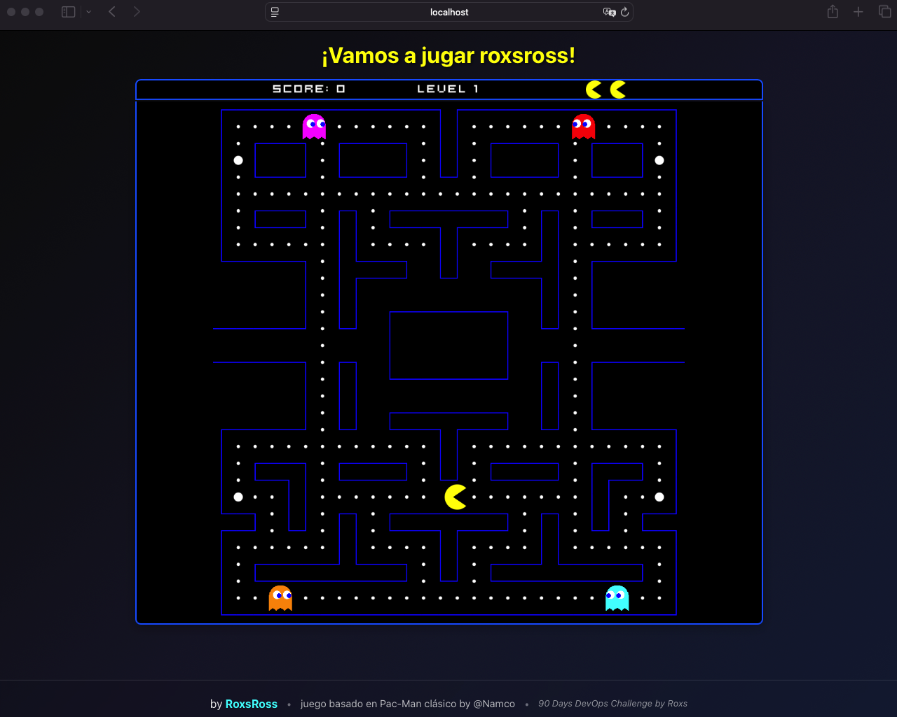
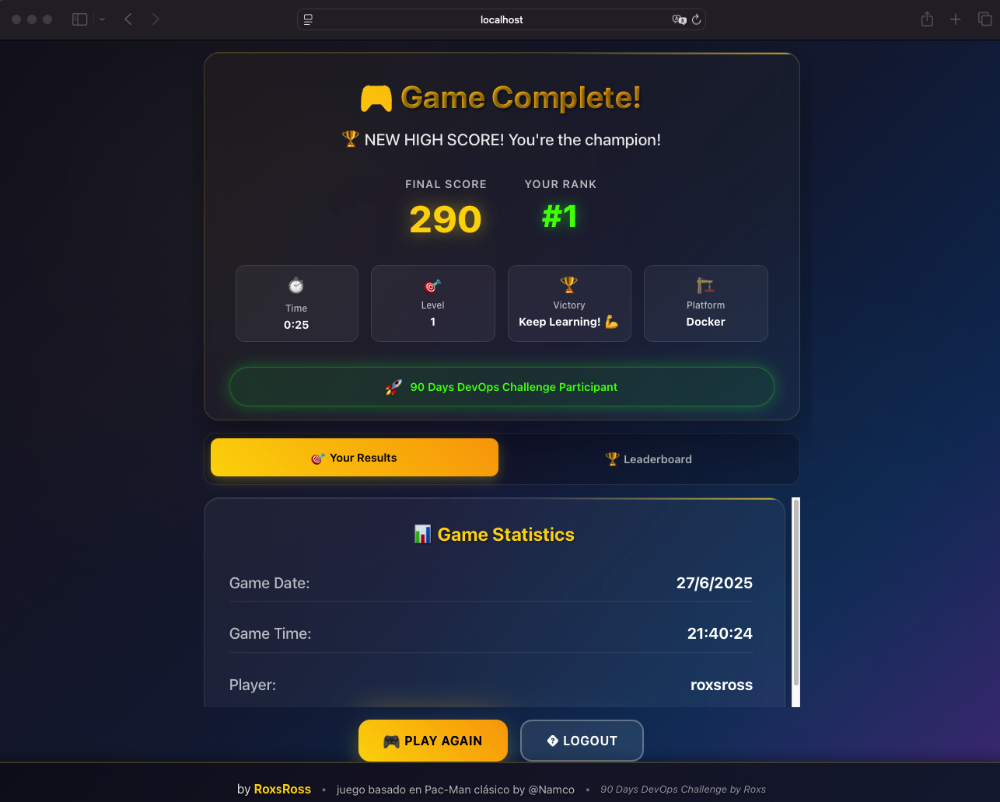
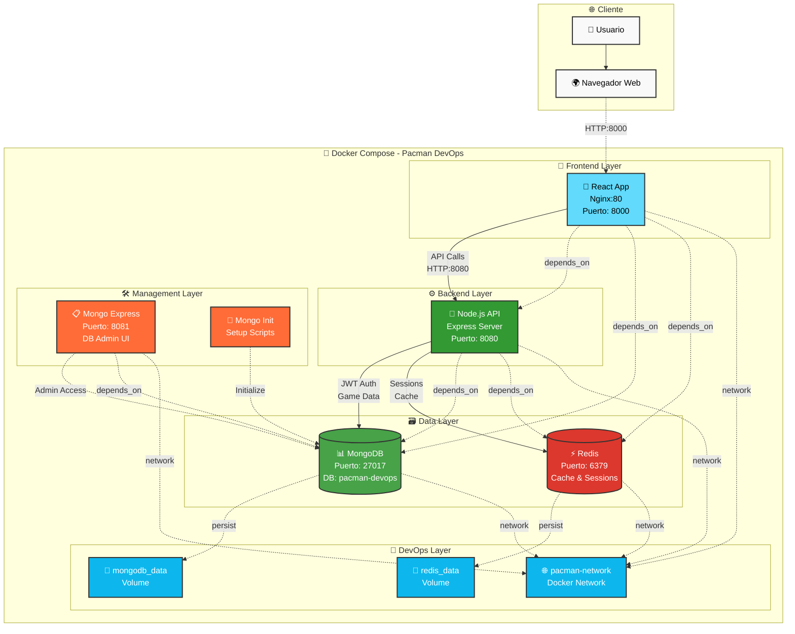
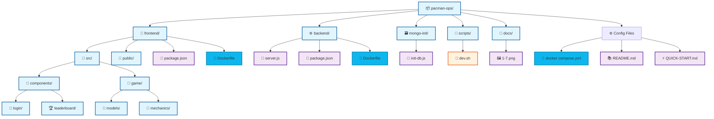
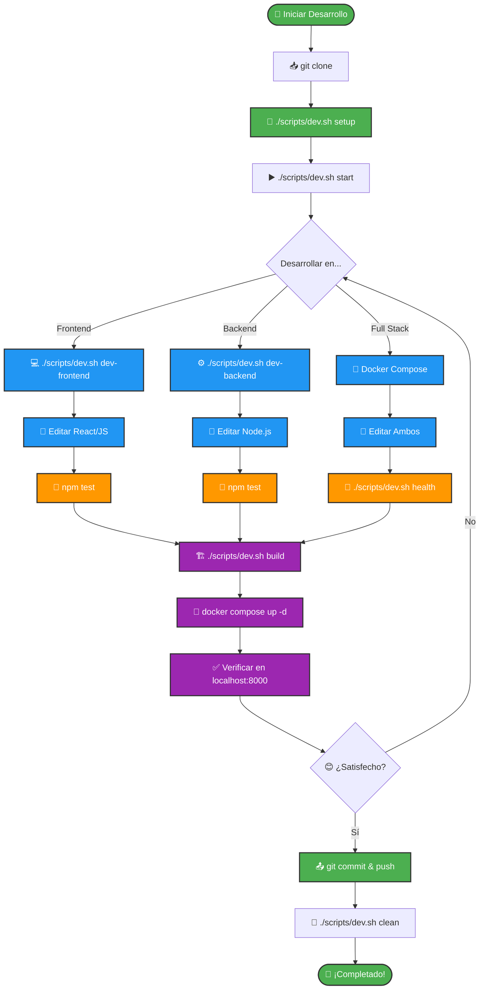
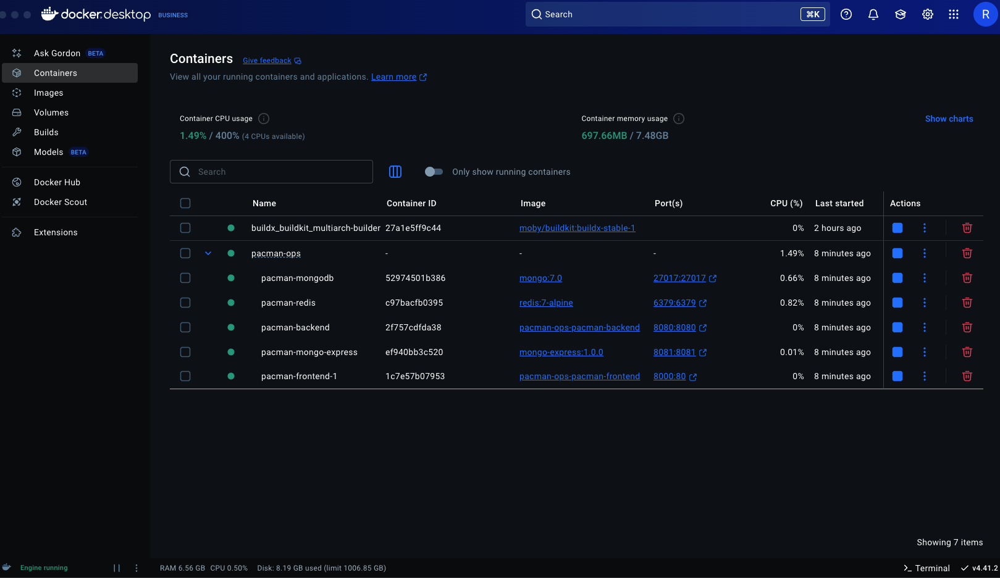

# 🎮 Pacman DevOps Challenge by Roxs


[](https://docker.com)
[](https://deepwiki.com/roxsross/roxs-pacman-ops)

# 🚀 90 Días de DevOps con Roxs

> **Proyecto educativo de DevOps** creado por **roxsross** para aprender conceptos fundamentales de desarrollo, contenedores, orquestación y monitoreo.

### Una implementación completa del clásico juego Pacman con arquitectura de microservicios, containerización Docker y prácticas DevOps modernas.


## 90DaysWithRoxs DevOps Challenge 🚀

<div align="center">

</div>

<div align="center">

## ✨ Características Destacadas

🎮 **Juego Completo** • 🐳 **Docker Ready** • 🔐 **Autenticación JWT** • 📊 **Leaderboard** • 🚀 **DevOps Scripts** • ⚡ **Redis Cache** • 🗃️ **MongoDB** • 📱 **Responsive**

[🚀 Inicio Rápido](#inicio-rapido) • [📸 Screenshots](#screenshots) • [🏗️ Arquitectura](#arquitectura) • [🐳 Docker](#docker) • [📱 Galería](#galeria-de-screenshots)

**💡 ¿Prefieres algo más directo?** → [QUICK-START.md](QUICK-START.md)  
**� ¿Necesitas ayuda con BD?** → [DATABASE-QUICK-REFERENCE.md](docs/DATABASE-QUICK-REFERENCE.md) ⭐  
**🗃️ ¿Queries de MongoDB/Redis?** → [DATABASE-QUERIES.md](docs/DATABASE-QUERIES.md)  
**🔧 ¿Problemas con las bases de datos?** → [DATABASE-TROUBLESHOOTING.md](docs/DATABASE-TROUBLESHOOTING.md)  
**⚡ ¿Redis avanzado?** → [REDIS-ADVANCED.md](docs/REDIS-ADVANCED.md)

</div>

## 📸 Screenshots

<div align="center">
<table>
<tr>
<td align="center" width="33%">
<br>
<b>🎮 Gameplay</b>
</td>
<td align="center" width="33%">
<br>
<b>🏆 Leaderboard</b>
</td>
<td align="center" width="33%">
<br>
<b>🔐 Autenticación</b>
</td>
</tr>
</table>
</div>

## 🏗️ Arquitectura



### 🔄 Flujo de Datos

1. **👤 Usuario** navega a http://localhost:8000
2. **📱 Frontend (React)** servido por Nginx
3. **🔧 Backend API** procesa requests en puerto 8080
4. **📊 MongoDB** almacena usuarios, puntuaciones y datos del juego
5. **⚡ Redis** maneja sesiones y cache de datos
6. **📋 Mongo Express** permite administración de la BD en puerto 8081

### 🏗️ Componentes Técnicos

| Componente | Tecnología | Puerto | Función |
|------------|------------|--------|---------|
| **Frontend** | React + Nginx | 8000 | Interfaz de usuario |
| **Backend** | Node.js + Express | 8080 | API REST y lógica de negocio |
| **Database** | MongoDB 7.0 | 27017 | Persistencia de datos |
| **Cache** | Redis Alpine | 6379 | Sesiones y cache |
| **Admin UI** | Mongo Express | 8081 | Administración de BD |
| **Network** | Docker Bridge | - | Comunicación interna |
| **Volumes** | Docker Volumes | - | Persistencia de datos |

## 📁 Estructura del Proyecto



## 🏃‍♂️ Inicio Rápido {#inicio-rapido}

### 1. Prerrequisitos

```bash
# Docker y Docker Compose
docker --version
docker compose --version

# Git
git --version
```

### 2. Clonar y Ejecutar

```bash
# Clonar el repositorio
git clone https://github.com/roxsross/roxs-pacman-ops.git
cd roxs-pacman-ops

# Iniciar todos los servicios
./scripts/dev.sh start

# O usando Docker Compose directamente
docker compose up -d
```

### 3. Acceder a la Aplicación

- 🎮 **Juego**: http://localhost:8000
- 🔧 **API**: http://localhost:8080
- 📊 **MongoDB Admin**: http://localhost:8081

## 🛠️ Scripts DevOps

El script `./scripts/dev.sh` facilita las operaciones comunes:

```bash
# Comandos disponibles
./scripts/dev.sh help

# Iniciar servicios
./scripts/dev.sh start

# Ver logs
./scripts/dev.sh logs

# Estado de servicios
./scripts/dev.sh health

# Limpiar todo
./scripts/dev.sh clean
```

### 🗃️ Scripts de Base de Datos

El script `./scripts/db-helper.sh` facilita las operaciones con MongoDB y Redis:

```bash
# Comandos disponibles
./scripts/db-helper.sh help

# Estadísticas MongoDB
./scripts/db-helper.sh mongo-stats
./scripts/db-helper.sh mongo-leaderboard

# Estadísticas Redis
./scripts/db-helper.sh redis-stats
./scripts/db-helper.sh redis-leaderboard

# Monitoreo en tiempo real
./scripts/db-helper.sh monitor-all

# Health check de bases de datos
./scripts/db-helper.sh health-check
```

El script `./scripts/db-troubleshooting.sh` proporciona herramientas avanzadas de diagnóstico:

```bash
# Health check completo
./scripts/db-troubleshooting.sh health

# Monitoreo en vivo
./scripts/db-troubleshooting.sh live-monitor

# Reparar problemas comunes
./scripts/db-troubleshooting.sh fix-connections
./scripts/db-troubleshooting.sh clean-cache

# Optimización
./scripts/db-troubleshooting.sh optimize-indexes
./scripts/db-troubleshooting.sh analyze-performance

# Mantenimiento
./scripts/db-troubleshooting.sh cleanup-old-data
./scripts/db-troubleshooting.sh backup-db
```

## 🎯 Características

### 🎮 Gameplay
- Juego Pacman completo con físicas precisas
- Sistema de puntuaciones en tiempo real
- Efectos de sonido y animaciones
- Controles responsivos (teclado/táctil)

### 🔐 Autenticación
- Registro e inicio de sesión
- Tokens JWT para seguridad
- Gestión de sesiones con Redis

### 📊 Leaderboard
- Puntuaciones globales
- Historial personal
- Tiempo de juego registrado
- Estadísticas avanzadas

### 🏗️ DevOps
- Containerización completa
- Volúmenes persistentes
- Redes Docker aisladas
- Health checks automáticos
- Logs centralizados

## 🔄 Flujo de Desarrollo



## 🧪 Desarrollo

### Frontend (React)

```bash
cd frontend

# Desarrollo local
npm install
npm start

# Build de producción
npm run build

# Testing
npm test
```

### Backend (Node.js)

```bash
cd backend

# Desarrollo local
npm install
npm run dev

# Testing
npm test

# Producción
npm start
```

## 🐳 Docker {#docker}

### Builds Individuales

```bash
# Frontend
docker build -t pacman-frontend ./frontend

# Backend
docker build -t pacman-backend ./backend
```

### Docker Compose

```bash
# Construir y ejecutar
docker compose up --build

# Solo ejecutar
docker compose up -d

# Ver logs
docker compose logs -f

# Detener
docker compose down
```

## 📦 Volúmenes Persistentes

Los datos se persisten automáticamente:

- `mongodb_data` - Datos de MongoDB
- `redis_data` - Cache de Redis

## 🔧 Variables de Entorno

### Frontend
- `REACT_APP_BACKEND_URL` - URL del backend
- `NODE_ENV` - Entorno de ejecución

### Backend
- `MONGODB_URI` - Conexión a MongoDB
- `REDIS_URL` - Conexión a Redis
- `JWT_SECRET` - Clave para tokens
- `PORT` - Puerto del servidor


## 📈 Monitoring (Próximamente)

> 🚧 **Próximamente:** Se integrará monitoreo avanzado con Prometheus, Grafana y alertas automáticas para todos los servicios.

### Health Checks

```bash
# Estado general
./scripts/dev.sh health

# Servicios individuales
curl http://localhost:8000/health  # Frontend
curl http://localhost:8080/health  # Backend
```

### Logs

```bash
# Todos los servicios
docker compose logs -f

# Servicio específico
docker compose logs -f pacman-frontend
docker compose logs -f pacman-backend
```

## 🧹 Limpieza

```bash
# Limpiar contenedores y redes
./scripts/dev.sh clean

# Limpiar volúmenes también
docker compose down -v
docker system prune -a
```

## 🚀 Despliegue

### Producción

> 🚧 **Próximamente:** Se incluirán instrucciones detalladas para ajustar la configuración y los scripts a un entorno de producción real, incluyendo variables seguras, optimización de imágenes Docker, y despliegue en servidores cloud.

#### Producción Local

```bash
# Build optimizado
docker compose -f docker compose.yml up --build -d

# Verificar servicios
./scripts/dev.sh health
```

### Variables de Producción

Asegúrate de configurar:
- JWT_SECRET único y seguro
- URLs de base de datos production
- Configuración de CORS apropiada

## 📱 Galería de Screenshots {#galeria-de-screenshots}

<div align="center">
<details>
<summary><b>🖼️ Ver todas las capturas (7 imágenes)</b></summary>
<br>

<table>
<tr>
<td align="center" width="33%">
<br>
<b>🎮 Pantalla Principal</b>
</td>
<td align="center" width="33%">
<br>
<b>🕹️ Gameplay</b>
</td>
<td align="center" width="33%">
<br>
<b>🏆 Leaderboard</b>
</td>
</tr>
<tr>
<td align="center" width="33%">
<br>
<b>👤 Login Join</b>
</td>
<td align="center" width="33%">
<br>
<b>🐳 Docker</b>
</td>
</tr>
<tr>
</tr>
</table>

</details>
</div>

## 📚 Documentación Adicional

### 🗃️ Bases de Datos
- **[DATABASE-QUICK-REFERENCE.md](docs/DATABASE-QUICK-REFERENCE.md)** ⭐ - **EMPEZAR AQUÍ** - Índice completo y referencia rápida
- **[DATABASE-QUERIES.md](docs/DATABASE-QUERIES.md)** - Guía completa de queries MongoDB y Redis
- **[DATABASE-TROUBLESHOOTING.md](docs/DATABASE-TROUBLESHOOTING.md)** - Troubleshooting avanzado y optimización
- **[REDIS-ADVANCED.md](docs/REDIS-ADVANCED.md)** - Uso avanzado de Redis para el juego
- **[GAME-QUERIES-EXAMPLES.md](docs/GAME-QUERIES-EXAMPLES.md)** - Ejemplos prácticos específicos

### 🚀 Guías de Inicio
- **[QUICK-START.md](QUICK-START.md)** - Inicio rápido en 5 minutos
- **[docs/README.md](docs/README.md)** - Índice visual de documentación

### 🛠️ Scripts DevOps
- **[scripts/dev.sh](scripts/dev.sh)** - Script principal de desarrollo
- **[scripts/db-helper.sh](scripts/db-helper.sh)** - Operaciones básicas de BD
- **[scripts/db-troubleshooting.sh](scripts/db-troubleshooting.sh)** - Diagnóstico avanzado

## 🤝 Contribución

1. Fork el proyecto
2. Crea una rama feature (`git checkout -b feature/AmazingFeature`)
3. Commit cambios (`git commit -m "Add AmazingFeature"`)
4. Push a la rama (`git push origin feature/AmazingFeature`)
5. Abre un Pull Request

## 📋 TODO

- [ ] Tests de integración
- [ ] Seguridad
- [ ] Configuraciones Producción
- [ ] CI/CD Pipeline
- [ ] Kubernetes manifests
- [ ] Monitoring con Prometheus
- [ ] SSL/TLS certificates


## 👥 Equipo

- **Roxs** - DevOps Challenge Creator
- **Comunidad** - Contributors

---

## 📄 Licencia

Este proyecto está licenciado bajo MIT License - ver el archivo [LICENSE](LICENSE) para detalles.

## 👨‍💻 Autor

**roxsross** - Instructor DevOps y Cloud

- 🐦 Twitter: [@roxsross](https://twitter.com/roxsross)
- 🔗 LinkedIn: [roxsross](https://linkedin.com/in/roxsross)
- ☕ Ko-fi [roxsross](https://ko-fi.com/roxsross)
- ▶️ Youtube [295devops](https://www.youtube.com/@295devops)
- 📧 Email: roxs@295devops.com

---

⭐ **¡Dale una estrella si este proyecto te ayudó!** ⭐

